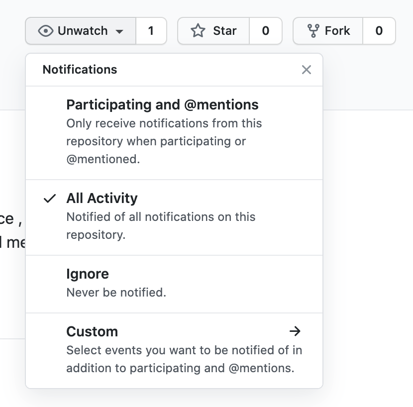

# MemberPrism 
open source alternative to memberstack / memberspace , but with both front and backend member-only content protection
Will open source soon , please watch the repo for updates.

  

# 漫波之镜

Memberstack / memberspace 的开源替代品 , 但在会员内容保护上更为强大，同时提供了基于前端和后端的保护。
即将开源，请 watch repo 获得更新通知。

  
