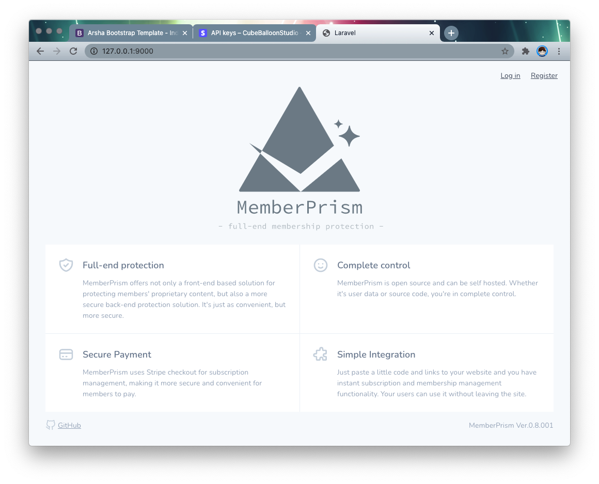
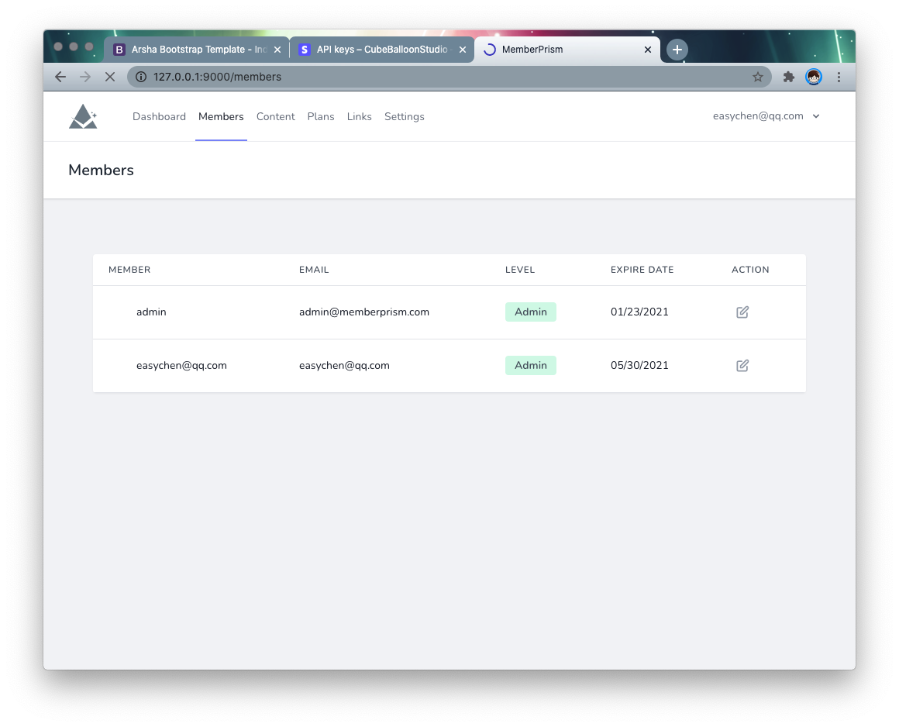
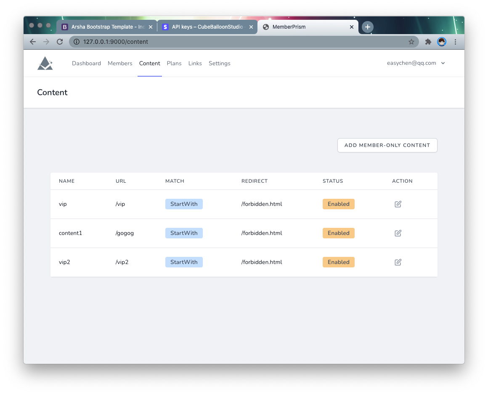
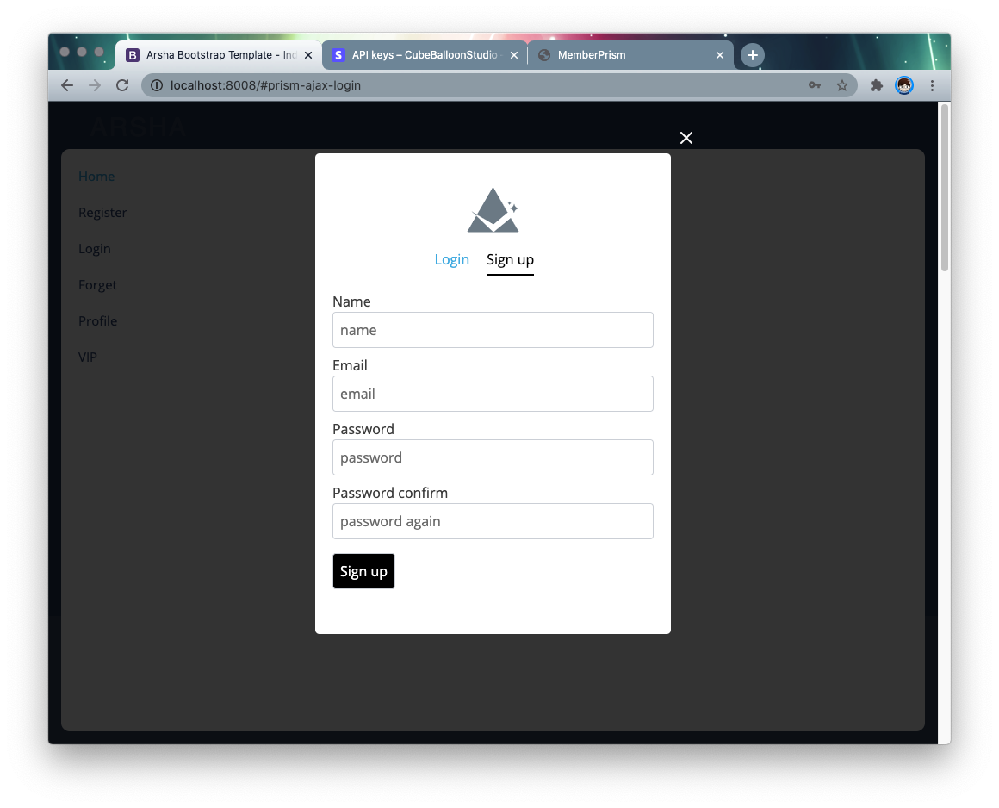
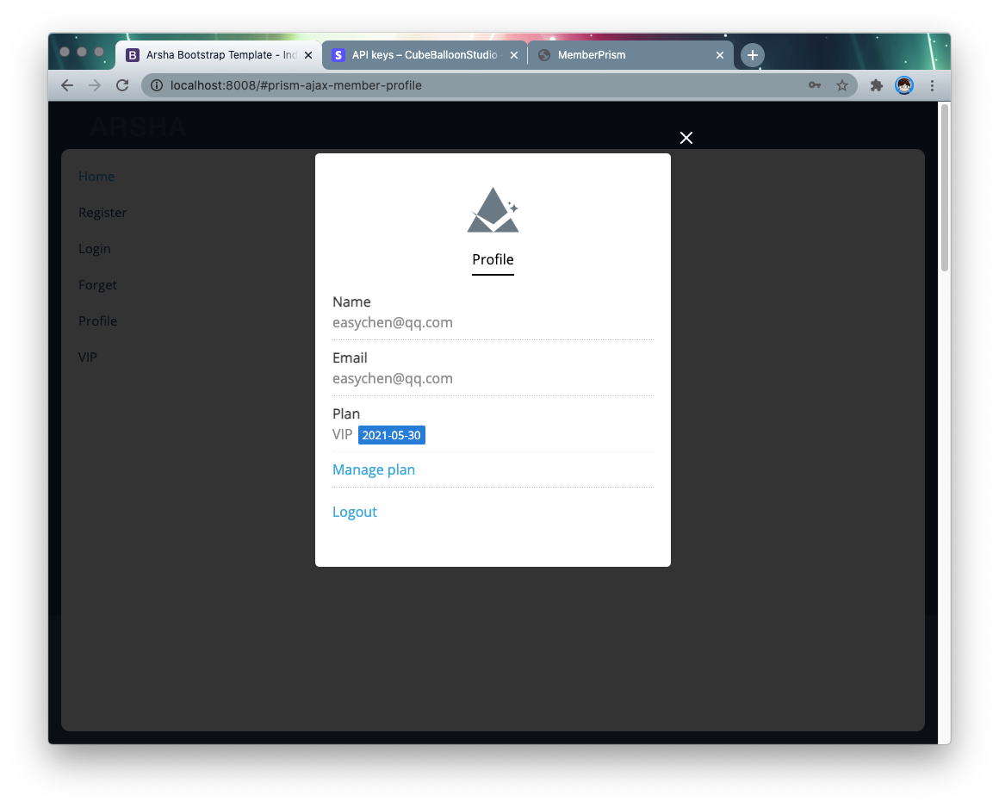
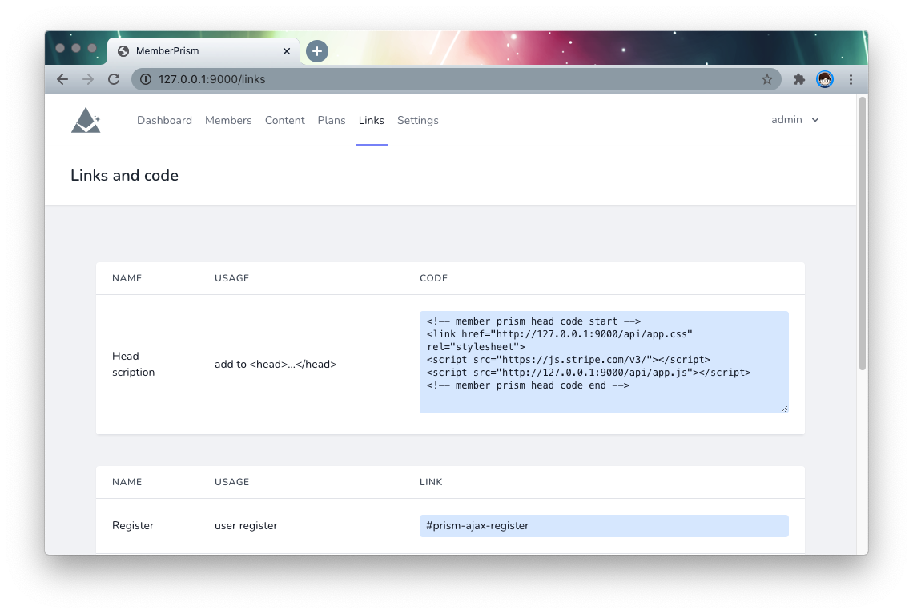
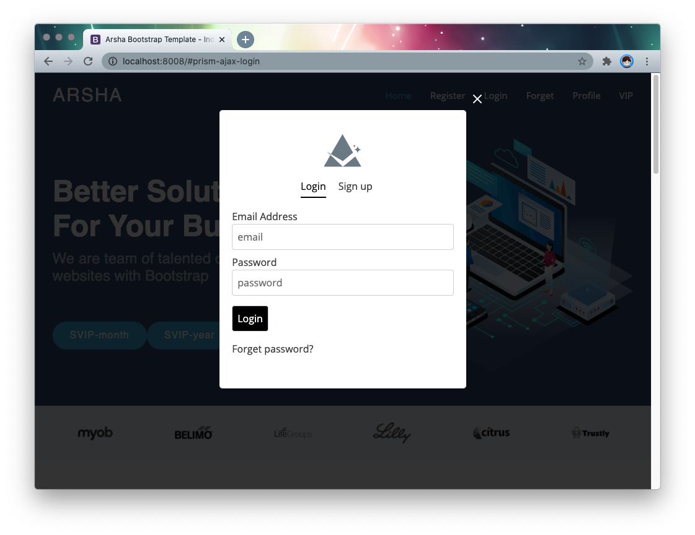
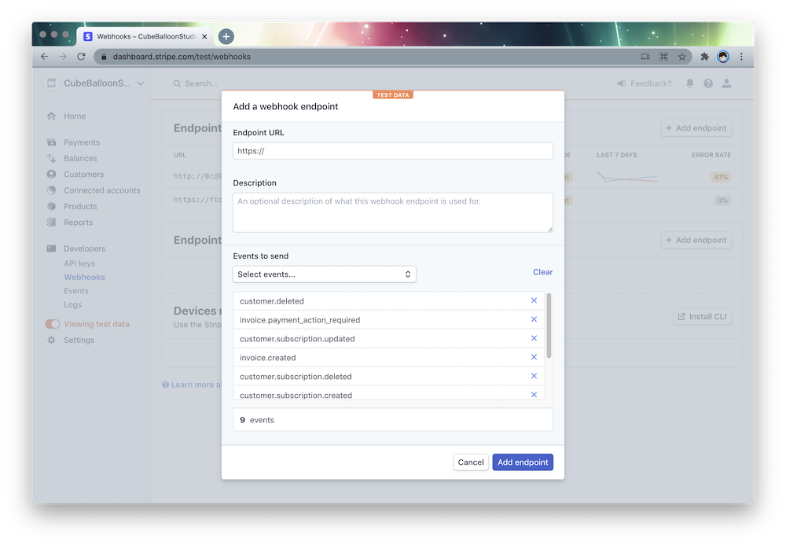

# MemberPrism Documentation

[简体中文](/zh/)

⚠️ This document was translated into English by deepl and can be improved by PR

## Introduction

MemberPrism is an open source project for providing membership, subscription and content protection features to existing websites, especially static ones.

It features a plug-in approach that allows you to add functionality immediately with a few lines of code. At the same time, these features are implemented in a floating layer format, so that users do not need to leave the site to complete the above features.

### Features

MemberPrism currently provides the following features.

- Membership Management
    - Registration
    - Login
    - Logout
    - Change user level: user/admin
- Subscription Management
    - Add, modify, delete, deactivate subscription plans
    - Subscribe to a plan through a link
    - User modify, unsubscribe
- Member content protection
    - Add, modify, delete, deactivate member content
    - Assigning member content to a subscription plan
    - Front-end protection of member content via JavaScript
    - Back-end protection of member content via MemberProxy


### Screenshot

  

  

  

  

  

  

  

  

  

## Installation

### Installation via Docker

For easy installation, we provide the Docker installation method. It is also recommended to use this method in preference.

#### Dependency Environment

First, you need a container environment that supports `git` and `docker-compose`. If you don't already have it, you can refer to [this article](https://www.digitalocean.com/community/tutorials/how-to-install-and-) use-docker-compose-on-ubuntu-20-04).

#### Initialization

Start by clone the project code

```bash
git clone https://github.com/easychen/member-prism.git prism
```

Go to the directory and start the service with `docker-compose`

```bash
cd prism && docker-compose up -d
```

The service will start two ports.

- 8801: MemberPrism, the website
- 8802: MemberProxy, where users will access when backend protection is enabled

The ports for these two services can be adjusted by modifying the `port` section in `docker-compose.yaml` in the root directory.

```yaml
ports:
    - '8801:80'
    - '8802:8802'
```

##### HTTPS Support

First, put the certificate in the `ssl` directory.

Open `docker/web/vhost.conf` and remove the comments before the following lines.

```conf
SSLEngine on
SSLCertificateFile /app/ssl/server.crt
SSLCertificateKeyFile /app/ssl/server.key
```

Open `web/.env` and change `PRISM_HTTPS` to `true`.

```conf
PRISM_HTTPS=true
```


### Manual installation

The main part of MemberPrism is written in Laravel, so developers who are familiar with Laravel can easily build it.

Go to the web directory
```bash
cd /app/web 
```

Install the dependencies via compser
```bash
composer install 
```

Copy `.env.example` to `.env` and modify it as appropriate.

```bash
cp .env.example .env 
```

Generate the app key 
```bash
php artisan key:generate 
```

Initialize the database and fill in the default account
```bash
php artisan migrate --seed
```

You need to make sure the following directories are writable, you can change them to 755 or 777.

```bash
chmod -R 0777 /app/web/storage
chmod -R 0777 /app/web/bootstrap/cache/
```

Start proxy

```bash
cd /app/proxy && . /server-linux &
```

If you are on a Mac environment, use

```bash
cd /app/proxy && . /server-mac &
```

## Adding functionality to a website

First clarify the following terms.

- `TargetSite`: the site where you need to add membership and subscription features
- `PrismSite`: default `8801` port corresponding to the main site
- `ProxySite`: default `8802` port corresponding to the proxy site

After installation, visit `<ip>:8801` to access `PrismSite`.

### Admin account

Login with the following account.

- Username: `admin@memberprism.com` 
- Password: `admin`

After logging in, go to the `members` page and click `level` to change the user's level.
  


### Configure the URL

Go to the `Settings` page and set the name and URL of the `PrismSite` website. This URL will finally need to be accessible to `TargetSite` users.

  


### Get the installation code

Go to the `Links` page, copy `Head scripts` and paste it into the `<head>` tag on the `TargetSite` site page. Note that this code needs to be added to any page that wants to use the MemberPrism feature.

  

### Copy feature links

At the bottom of the `Links` page, there is the URL for `Login`, which can be copied and pasted into the corresponding link in `TargetSite`.

The code looks like

```html
<a href="#prism-ajax-login">Login</a
```

When clicked, the result looks like this.

  

After adding the `registration`, `profile` links, this site will have a user system.

## Subscription configuration

MemberPrism uses [Stripe](https://stripe.com) to implement payment and subscription related features. This requires you to register a Stripe account first.

The following is an example of `test mode`.

### Configure Stripe Key

Open the [API Keys page](https://dashboard.stripe.com/test/apikeys) under the `Developers` menu.

  

Copy the corresponding Key and fill in the corresponding option in `Settings` of `PrismSite`: !

  

### Configure Stripe WebHook

Since users can make changes to their subscriptions on the Stripe website, subscription changes and payment confirmations in MemberPrism are made through a webhook.

The webhook requires an externally accessible URL, so it is recommended that you configure it after going live. If you are debugging locally, you can use ngrok for intranet penetration.

Suppose the URL of the `PrismSite` website is `http://D.com`, then the webhook endpoint URL is `http://D.com/stripe/webhook`.

  


Select the following events at events to send.

1. invoice.created
2. invoice.paid
3. invoice.payment_action_required
4. customer.subscription.created
5. customer.subscription.updated
6. customer.subscription.deleted
7. customer.created
8. customer.updated
9. customer.deleted

Note that `customer.subscription.updated` is a subscription change, which is not handled by default due to the cloud application-specific elevation logic behind it. You can implement it in `app/Http/Controllers/WebhookController.php` by yourself.


### Create Price ID

Go to the Stripe dashboard and create a [product](https://dashboard.stripe.com/test/products/create).

Note that in the Pricing section, select Recurring so that it will automatically renew. Just fill in the rest of the fields as you want.

  


After creating the product, go to the product details page and you can see the API ID in the Pricing section and record it.

  

You can create multiple prices according to your needs, and each level of subscription, monthly and yearly payment should be a different price id. These price ids need to be recorded and will be used later when you create a subscription plan.

### Creating a subscription plan

Go back to the `PrismSite` backend, go to the `Plans` page, and create a `Plan`. The `price ids` you need here are the same ones you created above.

  

Fill in `price id` in order to create multiple `Plan`s.

When you return to the `Links` page, at the bottom you can see the subscription links for the `plan` you just created.

  

Add these links to the corresponding places in the `TargetSite` and the user will be redirected to the payment page when they click on it. (Login screen will be displayed for non-logged in users)

### Member-only content protection

Suppose the URL in `TargetSite` is `http://t.com/` and the member-visible content is placed in the `vip` directory. Now it is not protected and can be accessed directly through `http://t.com/vip/some.html`.

Next, we will protect this directory.

Go to the `Content` page of `PrismSite` and create a `content`.

- Folder or pages URL: the protected directory or pages, in the above example, fill in `/vip` 
- Match type: StartWith means the URL is protected as long as it starts with `/vip`; Exact means exact match
- Redirect for non-members: The description page to be redirected to when non-members visit. This is usually the sales page for subscriptions.

  

### Assigning content to a subscription plan

Go to the `Plans` page of `PrismSite` and you can assign member-visible content to the subscription plan. By clicking the edit icon in the `Contents` column of the list, you can select which content is available to members of this plan.

  

Here Content can be multi-selected, hold Shift /Alt to select more than one.

Hold Shift /Alt to select more than one. [picture 13](./images/92ade1fe984e3dded00156cbe7920d0de9d243f262b1a03c902583552ac61a03.png)  

After saving, the front-end protection will take effect in real time. The back-end protection will take effect after the user login expires (default is two days).

Modify the `PRISM_MEMBER_EXPIRE_DAYS` setting in `web/.env` to make changes to the expiration time.

```conf
PRISM_MEMBER_EXPIRE_DAYS=2
```

## Back-end protection

### Principle

The principle of front-end protection is that we add some JavaScript code to `TargetSite` that checks regularly, and when the user visits the protected URL and is not a member, we make the browser jump to another page. This way the protection is achieved.

But in reality, the content is actually already in the browser, it's just not displayed, or it's displayed for a very short time. The content can actually be found by looking at the HTML, for example.

To support scenarios that require more stringent protection of user content, MemberPrism provides proxy-based back-end protection.

The principle of back-end protection is that the user accesses the `TargetSite`, but now accesses the `ProxySite` instead of the `TargetSite` directly. The `ProxySite` will first check if the user is accessing member content, and if they are a member. If the permissions are not enough, they are redirected directly.

The difference is that in the back-end protection scheme, the member content is not sent to the browser, thus achieving true protection.

### Usage

Go to the `Settings` page of `PrismSite` and pull down to the bottom.

Fill in the `Source site URL` with the URL of the `TargetSite` and the `Proxy site URL` with the URL of the `ProxySite` (that is, the URL that the end user accesses).

The page will be redirected to the `Proxy site URL` after a successful payment, etc., so be sure to fill it in correctly. 

  

When you are done, click `Save` to save. After the page is refreshed, click `Update proxy settings` to generate the proxy settings. Each time you update the proxy-related functions in the future, you will need to manually click once.

If the configuration is correct, the user should be able to use it normally via the `Proxy site URL`.

### Security

In the previous configuration, `TargetSite` and `ProxySite` can be accessed at the same time. Users who know the `TargetSite` URL may be able to bypass the back-end protection.

Here we just need to add IP access restrictions to `TargetSite`, for example, so that it can only be accessed by the IP of `ProxySite`, to prevent the above potential problems.

## More

### About the author

- HP: <https://ftqq.com>
- Twitter: <https://twitter.com/easychen> 
- Email: easychen(a.t)gmail.com