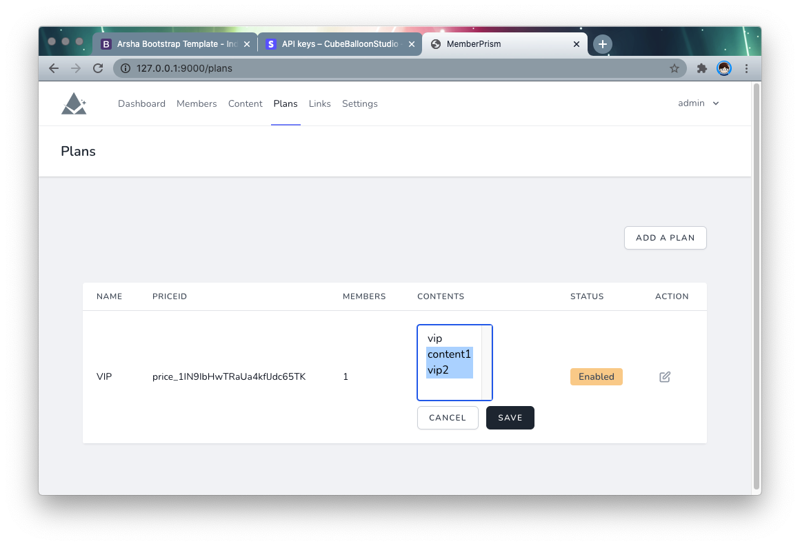

# MemberPrism 文档

[English](/)

## 简介

MemberPrism 是一个为现有网站、尤其是静态网站提供会员、订阅和内容保护功能的开源工具。

它的特色在于采用插件方式，只需要简单添加几行代码，就可以立刻完成功能的添加。同时，这些功能采用浮层的形式实现，用户不需要离开网站就可以完成以上功能。

### 功能

MemberPrism 目前提供的功能包括：

- 会员管理
    - 注册
    - 登入
    - 登出
    - 修改用户等级：普通用户/管理员
- 订阅管理
    - 添加、修改、删除、停用订阅计划
    - 用户通过链接订阅计划
    - 用户修改、取消订阅
- 会员内容保护
    - 添加、修改、删除、停用会员内容
    - 为订阅计划分配会员内容
    - 通过 JavaScript 进行会员内容的前端保护
    - 通过 MemberProxy 进行会员内容的后端保护

### 截图

  

  

  

  

  

  

  

  

  

## 安装

### 通过 Docker 安装

为了方便安装，我们提供了 Docker 安装方式。也推荐优先使用本方式。

#### 依赖环境

首先，你需要一个支持 `git` 和 `docker-compose` 的容器环境，如果还没有安装，可以参考[这篇文章](https://www.digitalocean.com/community/tutorials/how-to-install-and-use-docker-compose-on-ubuntu-20-04)。

#### 初始化

首先通过 clone 本项目代码

```bash
git clone https://github.com/easychen/member-prism.git prism
```

进入目录，通过 `docker-compose` 启动服务

```bash
cd  prism && docker-compose up -d
```

服务将启动两个端口：

- 8801：MemberPrism，网站
- 8802: MemberProxy，启用后端保护时，用户将访问这里

可以通过修改根目录下的 `docker-compose.yaml` 中 `port` 部分调整这个两个服务的端口：

```yaml
ports:
    - '8801:80'
    - '8802:8802'
```

##### HTTPS 支持

首先，将证书放入 `ssl` 目录下。

打开 `docker/web/vhost.conf`，去掉以下行之前的注释：

```conf
SSLEngine             on
SSLCertificateFile    /app/ssl/server.crt
SSLCertificateKeyFile /app/ssl/server.key
```

打开 `web/.env` 修改 `PRISM_HTTPS` 为 `true`：

```conf
PRISM_HTTPS=true
```


### 手动安装

MemberPrism 的主程序部分采用 Laravel 编写，熟悉 Laravel 的开发者可以很容易地进行搭建。

进入 web 目录
```bash
cd /app/web 
```

通过 compser 安装依赖
```bash
composer install 
```

复制 `.env.example` 为 `.env`，并根据具体情况进行修改。

```bash
cp .env.example .env 
```

生成 app key 
```bash
php artisan key:generate 
```

初始化数据库并填入默认账号
```bash
php artisan migrate --seed
```

需要确认以下目录可写入权限，可以改为 755 或者 777。

```bash
chmod -R 0777 /app/web/storage
chmod -R 0777 /app/web/bootstrap/cache/
```

启动 proxy

```bash
cd /app/proxy && ./server-linux &
```

如果是 Mac 环境，请使用

```bash
cd /app/proxy && ./server-mac &
```

## 为网站添加功能

首先明确以下名词：

- `TargetSite`：需要添加会员和订阅功能的网站
- `PrismSite`: 默认 `8801` 端口对应的主网站
- `ProxySite`: 默认 `8802` 端口对应的代理网站

安装完成后，访问 `<ip>:8801` 即可进入 `PrismSite`。

### 管理账号

使用以下账号登入：

- 用户名： `admin@memberprism.com` 
- 密码：`admin`

登入后，进入 `members` 页面，点击 `level` 可以修改用户的等级。
  


### 配置网址

进入 `Settings` 页面，设置`PrismSite`网站的名称、网址。此网址最后需要`TargetSite`的用户可以访问。

  


### 获得安装代码

进入 `Links` 页面，复制 `Head scripts` 并粘贴到`TargetSite`网站页面的 `<head>` 标签中。注意，希望用到MemberPrism功能的网页都需要添加这段代码。

  

### 复制功能链接

在 `Links` 页面下方，有`登入`用的 URL，可复制后粘贴到 `TargetSite` 中对应的链接中。

代码形如：

```html
<a href="#prism-ajax-login">Login</a>
```

点击后，效果如图：

  

添加完 `注册`、`个人资料`等链接后，此网站就具有了用户系统。

## 订阅配置

MemberPrism 使用 [Stripe](https://stripe.com) 来实现支付和订阅相关功能。这需要你先注册一个 Stripe 账号。

以下以 `test mode` 为例进行说明。

### 配置 Stripe Key

打开 `Developers` 菜单下的 [API Keys页面](https://dashboard.stripe.com/test/apikeys)。

  

复制对应的 Key，并填入 `PrismSite` 的 `Settings` 中的对应选项：

  

### 配置 Stripe WebHook

由于用户可以在 Stripe 网站对其订阅进行修改，所以 MemberPrism 中的订阅修改和支付确认都是通过 webhook 来进行的。

webhook 需要填写外网可访问的 URL，建议上线后再进行配置。如果是在本机调试，可以使用 ngrok 进行内网穿透。

假设 `PrismSite` 网站的网址是 `http://D.com`，那么 webhook endpoint URL 则为 `http://D.com/stripe/webhook`。

  


在 events to send 处选择以下事件：

1. invoice.created
2. invoice.paid
3. invoice.payment_action_required
4. customer.subscription.created
5. customer.subscription.updated
6. customer.subscription.deleted
7. customer.created
8. customer.updated
9. customer.deleted

注意其中 `customer.subscription.updated` 为订阅变更，由于背后涉及到云应用具体的升降级逻辑，默认并未进行处理。可以在 `app/Http/Controllers/WebhookController.php` 中自行实现。


### 创建 Price ID

进入 Stripe dashboard，创建一个 [product](https://dashboard.stripe.com/test/products/create)。

注意在 Pricing 部分，选择 Recurring ，这样才能自动续费。其他的项按自己的需求填写即可。

  


创建完成后，进入该 product 详情页面，可以看到  Pricing 一节中的 API ID，将其记录下来。

  

根据自己的需要，可创建多个 price ，各个等级的订阅、按月和按年支付，都应该是不同的 price id 。这些 price id 需要记录下来，稍后创建订阅计划时需要用到。

### 创建订阅计划

回到 `PrismSite` 后台，进入 `Plans` 页面，创建一个 `Plan`。这里需要的 `price id` 就是上文创建的那些。

  

依次填入 `price id`，创建多个 `Plan`。

这时候回到 `Links` 页面，在最下方可以看到刚才创建 `plan` 的订阅链接。

  

将这些链接添加到 `TargetSite` 中对应的地方，用户点击后将转向支付页面。（未登入用户会显示登入界面）

### 会员可见内容保护

假设在 `TargetSite` 的 URL 为 `http://t.com/`，会员可见内容放到 `vip` 目录下。现在没有保护，可以直接通过 `http://t.com/vip/some.html`进行访问。

下边我们将这个目录保护起来。

进入 `PrismSite` 的 `Content` 页面，创建一个 `content`。

- Folder or pages URL：保护的目录或者网页，在上边的例子中，填入 `/vip` 
- Match type：StartWith 指网址中只要以 `/vip` 开头，都进行保护；Exact 指精确匹配
- Redirect for non-members：当非会员访问时，转向的说明页面。一般是订阅的销售页面。

  

### 为订阅计划分配内容

进入 `PrismSite` 的 `Plans` 页面，可以为订阅计划分配会员可见内容。点击列表中 `Contents` 列的编辑图标，可以选择此计划的会员可以阅读哪些内容。

  

这里的 Content 可以多选，按住 Shift /Alt 可以选择多个。

  

保存后，前端保护将实时生效。后端保护将在用户登入过期后（默认为两天）生效。

修改 `web/.env` 中的`PRISM_MEMBER_EXPIRE_DAYS` 设置，可以对过期时间进行修改。

```conf
PRISM_MEMBER_EXPIRE_DAYS=2
```

## 后端保护

### 原理

前端保护的原理是，我们为 `TargetSite` 添加了一些 JavaScript 代码，这些代码会定时检查，当用户访问到被保护的 URL ，而且又不是会员时，我们让浏览器跳转到其他页面。这样就实现了保护。

但实际上，内容其实已经到了浏览器中，只是没有显示，或者说显示的时间很短而已。通过查看 HTML 等方式，实际上是可以找到这些内容的。

为了支持需要更为严格的保护用户内容的场景，MemberPrism 提供了基于代理的后端保护。

后端保护的原理是，原来用户访问 `TargetSite`，现在改为访问 `ProxySite`，不再直接访问`TargetSite`。`ProxySite` 会先检查用户是否在访问会员内容，以及是否会员。如果权限不够，直接让其转向。

区别在于，后端保护方案中，会员内容不会发送到浏览器，从而实现了真正意义上的保护。

### 使用

进入 `PrismSite` 的 `Settings` 页面，拉到最下方。

在 `Source site URL` 中填入 `TargetSite` 的 URL，在 `Proxy site URL` 中填入`ProxySite`  的 URL（也就是最终用户访问的 URL）。

在支付等环节成功后，页面将重定向到 `Proxy site URL`，所以务必要正确填写。 

  

填写完成后，点击 `Save` 保存。页面刷新后，再点击 `Update proxy settings` 生成代理用的设置。以后每次更新代理相关功能，都需要手工点击一次。

如果配置正确，用户应该可以通过 `Proxy site URL` 正常使用了。

### 安全

在前边的配置中，`TargetSite` 和 `ProxySite` 是可以同时被访问的。知道`TargetSite`网址的用户可能绕开后端保护。

这里我们只需要给 `TargetSite` 加上 IP 访问限制，比如让其只能被 `ProxySite` 的 IP 访问，就可以防范以上的潜在问题。

## 更多

### 关于作者

- 个人主页：<https://ftqq.com>
- 微博：<https://weibo.com/easy>
- Twitter：<https://twitter.com/easychen>